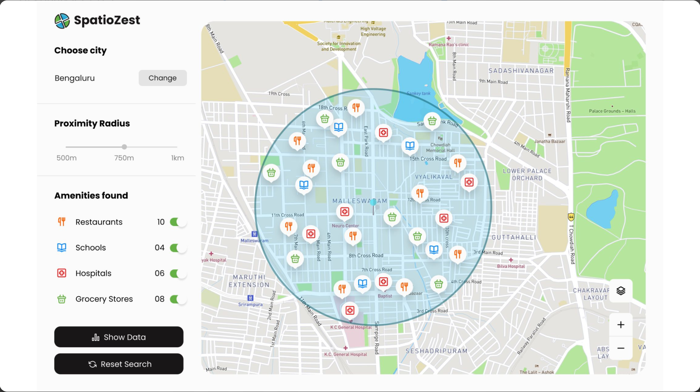

# Style guide

## Prototyp
The goal of this project, it's to create a prototyp web app.


## Color
```
--background-project : #FBFBFB
--balck-project : #090909
--green-project : #64B144
```

## Icon
Kit's code : <script src="https://kit.fontawesome.com/c4c0df9b23.js" crossorigin="anonymous"></script>

``` Amenities
Moque : <i class="fa-solid fa-mosque"></i>
Islamic center : <i class="fa-solid fa-building"></i>
```

``` Others
Minus : <i class="fa-solid fa-building"></i>
Plus : <i class="fa-solid fa-plus"></i>
Layers : <i class="fa-solid fa-layer-group"></i>
Reset : <i class="fa-solid fa-rotate"></i>
Go : 
```


## Font
Search from [WhatTheFont](https://www.myfonts.com/WhatTheFont/result)

```Google font
Import : @import url('https://fonts.googleapis.com/css2?family=Darker+Grotesque:wght@300;500;700&display=swap');
Font-family : font-family: 'Darker Grotesque', sans-serif;
```